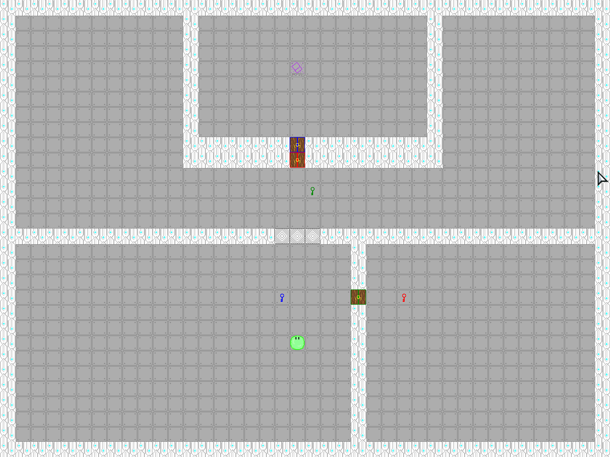

# Only One
This is a small top-donw 2d grid based puzzle game made for CSC303 at MSU

# Goal
Make it to the holo-cube at the end of each level

# Screenshot

[Play here!](https://zelphy712.github.io/haxe-game-final-project/)
